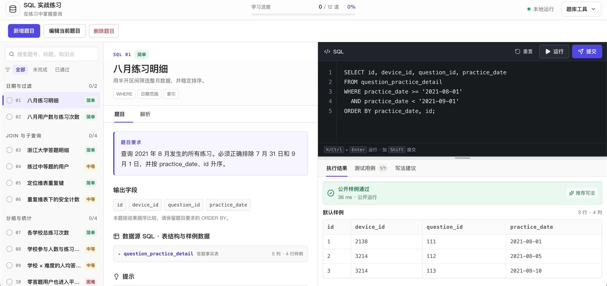

# SQL 实战练习

一个集 SQL 编写、执行、判题与题库管理于一体的练习工作台。通过业务题目、样例数据和结果对比，练习查询、关联、聚合与窗口函数，并记录学习进度。



## 功能

- **题库浏览**：按章节组织题目，支持搜索以及未完成、已通过筛选。
- **SQL 工作区**：查看题干、输出要求、表结构与样例数据，在编辑器中编写查询，并获得关键字、表名和字段名补全建议。
- **灵活布局**：题目数据表可按需展开；桌面端可调整编辑区与结果区的高度，设置会保存在浏览器中。
- **运行与提交**：运行后直接查看公开样例的输出，提交后查看用例状态；失败时展示结果差异和错误原因。
- **学习辅助**：提供分步提示、参考答案、解析、易错点与写法建议。写法建议不影响正确性判定。
- **进度记录**：提交通过后保存该题 SQL 与通过状态；未通过的题目切换回来会显示初始代码，支持重置学习记录。
- **切题确认**：切换题目时若有未提交的 SQL 修改，先确认是否丢弃，取消后可继续编辑。
- **题目管理**：通过表单新增、编辑和批量删除题目，支持解析初始化 SQL 并预览数据。
- **题库迁移**：以 JSON 导入、导出整个题库，导入前预览并校验题目配置。
- **响应式界面**：宽屏采用题库、题干、编辑器分区，窄屏通过标签切换工作区。

## 开始使用

要求 Node.js **22.13.0 或更高版本**。

```bash
npm ci
npm run dev
```

打开终端输出的访问地址。默认地址为 [http://localhost:3000](http://localhost:3000)。

## 练习流程

1. 选择题目，阅读业务目标、输出要求和样例数据。
2. 编写一条 `SELECT` 或 `WITH ... SELECT` 查询。
3. 点击“运行”检查公开数据上的结果。
4. 点击“提交”校验全部公开与隐藏用例。
5. 根据结果对比、提示和解析调整查询。提交通过后会保存当时的 SQL；未通过时切换题目会重新显示初始代码。

编辑器快捷键：

| 快捷键 | 操作 |
| --- | --- |
| `⌘ / Ctrl + Enter` | 运行公开用例 |
| `⌘ / Ctrl + Shift + Enter` | 提交全部用例 |
| `↑ / ↓` | 选择补全建议 |
| `Tab / Enter` | 插入选中的补全建议；无建议时 `Tab` 插入两个空格 |
| `Esc` | 关闭补全建议 |

桌面端还可以拖动编辑区下方的分隔线调整结果区大小；聚焦分隔线后可用方向键调整。

## 管理题目

顶部提供新增、编辑与批量删除入口。题目编辑分为三个步骤：

1. **题目说明**：配置题号、标题、章节、难度、标签、题干和输出字段。
2. **数据源**：填写完整初始化 SQL，自动解析表结构并预览样例；可添加独立的公开或隐藏高级用例。
3. **答案与解析**：配置初始代码、参考答案、提示、解析和可选的写法规则。

保存时会执行数据源 SQL，并校验参考答案在全部用例上的输出。校验失败会保留编辑内容；修改题目后会清除该题旧进度并恢复初始代码。批量删除需确认所选题目及其学习记录的影响范围。

### 导入与导出

通过右上角“题库工具”操作：

- **导出题库**：下载包含全部题目配置的 JSON 文件，文件名带有日期和时分秒。
- **导入题库**：选择 JSON 文件、查看预览，再校验并替换整个题库。支持最大 5 MB 的文件。
- 内容不变的题目保留已通过的 SQL 和进度；修改或移除的题目会清除旧记录。校验失败不会替换现有题库。

JSON 不包含学习记录，目前不支持单题导入、导出。界面中的配置修改保存在浏览器中，不会自动写回项目源码；需要共享或备份时请导出题库。

## 执行与判题

SQL 由 Web Worker 中的 `sql.js` 执行，每组用例使用独立的内存数据库。练习查询只允许单条只读语句，查询执行超过 2.5 秒会终止当前 Worker。

结果校验包括列名、行值、`NULL` 和重复行数量；是否比较行顺序由题目配置决定。数值比较允许 `1e-4` 的相对容差。

执行引擎基于 SQLite，并提供部分 MySQL 常用语法兼容能力，例如 `YEAR()`、`MONTH()`。MySQL 特有函数、排序规则、隐式类型转换及执行计划可能与实际 MySQL 不同；题目的语法说明会帮助辨别这些差异。

## 项目结构

```text
app/
  page.tsx                 页面入口
  layout.tsx               页面布局与基础元数据
  globals.css              全局样式与响应式布局
  sql-lab/
    challenges/            内置题目 JSON 配置
    SqlLab.tsx             工作台与交互状态
    SqlEditor.tsx          SQL 输入与补全
    ChallengeEditor.tsx    题目编辑表单
    CatalogImportDialog.tsx 题库导入与预览
    catalog-transfer.ts    题库导入、导出及内容比对
    challenge-config.ts    配置校验、迁移与增删改
    local-state.ts         已通过 SQL、进度与偏好校验
    problems.ts            题库注册与用例组装
    data-source.ts         SQL 表结构与数据读取
    source-inspector.ts    数据源 Worker 调用
    judge.ts               判题流程与超时控制
    judge-core.ts          查询、结果及写法检查
    sql-judge.worker.ts     SQL 执行 Worker
public/                    图标、分享图片与界面截图
vite.config.ts             vinext / Vite 配置
postcss.config.mjs         Tailwind CSS 配置
eslint.config.mjs          代码检查规则
```

题目配置使用 v2 格式：`dataSource.setupSql` 包含完整初始化脚本，额外用例分别提供独立的 `setupSql`。旧版配置在读取时自动迁移。新增内置题目时，在 `challenges/` 添加配置并在 `problems.ts` 注册。

## 技术栈与开发命令

React、TypeScript、vinext / Vite、Tailwind CSS、Lucide 与 sql.js。

| 命令 | 用途 |
| --- | --- |
| `npm run dev` | 启动开发服务 |
| `npm run build` | 构建项目 |
| `npm start` | 运行构建后的项目 |
| `npm run lint` | 检查代码规范 |
| `npm run typecheck` | 检查 TypeScript 类型 |
